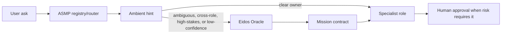

# Eidos Oracle

Eidos Oracle is the deliberative product layer that marries Eidos to ASMP.

ASMP answers:

- what services exist here;
- what they provide, own, support, and should not handle;
- how to discover and route to them.

Eidos Oracle answers:

- what kind of question is being asked;
- whether deterministic ASMP routing is enough;
- which services and human roles should participate;
- what evidence is required;
- what answer shape is acceptable;
- what authority or approval boundary applies.

Oracle is not part of the lean ASMP protocol core. It is an Eidos product built
on top of ASMP ambient discovery and routing metadata.

## Why It Exists

Real organizational questions are often not single-service lookups.

Examples:

- "Who is our MSP?"
- "Can we set up enterprise SSO for this vendor?"
- "Where are credentials stored?"
- "Is this access risk acceptable?"
- "What do the books imply about this provider?"

ASMP can find candidate services. Eidos Oracle turns the vague ask into a
mission contract so specialist agents can answer without guessing, overreaching,
or collapsing into a universal-agent pattern.

## Contract

The ASMP CLI can expose the first prototype as `asmp oracle` because the command
uses ASMP registry context. The product returned by that command is still Eidos
Oracle, not "ASMP Oracle".

`asmp oracle` returns:

- `product`: `Eidos Oracle`
- `intent`
- `should_invoke_oracle`
- `invoke_reasons`
- `question_type`
- `registry_state`
- `primary_owner`
- `role_hypotheses`
- `supporting_roles`
- `candidate_services`
- `human_authority`
- `evidence_required`
- `answer_format`
- `approval_boundaries`
- `confidence_criteria`
- `memory_update`
- `routing_tests`

## Invocation Policy

Use deterministic ASMP routing first when ownership is clear.

Invoke Eidos Oracle when:

- ASMP route confidence is low;
- multiple services are plausible;
- the ask crosses roles or systems of record;
- the ask is high-stakes for money, access, production, security, legal,
  customers, employees, or external communication;
- the user asks how a question should be answered;
- a previous route failed because a term was ambiguous.

Oracle should not execute the mission it plans. It hands the contract back to
ASMP and the specialist services.

## Architecture



Host adapters such as Codex, Eidos CLI, and Cerebro may call Ambient and pass
bounded hints into their own context windows. They are consumers of this
contract, not the canonical home of Oracle.

## CLI Prototype

```bash
asmp oracle "who should determine our MSP and what evidence counts?"
asmp --json oracle "can we set up enterprise SSO for this vendor?"
```

Use `--no-registry` to test the contract generator without a live ASMP registry:

```bash
asmp --json oracle --no-registry "where are credentials stored?"
```

## Non-Goals

- Oracle is not the ASMP protocol core.
- Oracle is not a replacement for MCP, A2A, specialist agents, or human
  authority.
- Oracle should not retrieve secrets, change state, contact external parties, or
  silently answer high-stakes questions.
- Oracle should not live inside a single host adapter such as Eidos CLI.
- Oracle should not be invoked on every prompt.

## Product Boundary

ASMP remains the host/service declaration and routing substrate.

Eidos Oracle is an Eidos product that uses ASMP as ambient infrastructure. This
is the marriage:

- ASMP provides the graph of local capabilities and ownership.
- Eidos provides the interpretive discipline: scope, mission, authority,
  evidence, and learning.
