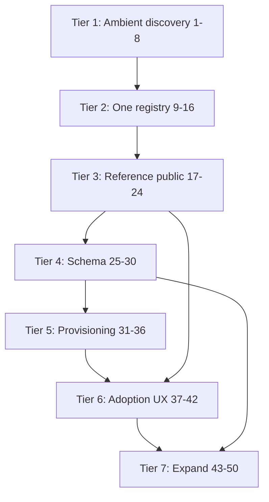

# ASMP Bootstrap Plan — 50 Items in Order

**Status:** Draft  
**Date:** 2026-06-25  
**Author:** Planning session (Software Engineer cockpit)  
**Litmus test:** A new agent session on any repo asks *"what can help me with email?"* and gets a real answer on turn one.

---

## Executive summary

ASMP has a working private implementation (`~/.asmp/`, director-daemon registry, 46 manifests) and public scaffolds (spec, docs site, research). The gap is **wiring**: discovery is not ambient, consumers still read legacy registries, and the reference server is not a standalone package.

This plan sequences 50 items across 7 tiers. **Do not skip tiers.** Tier N+1 assumes Tier N gate criteria are met.

| Tier | Items | Theme | Gate to proceed |
|------|-------|-------|-----------------|
| 1 | 1–8 | Ambient discovery | Litmus test passes from 3+ repos |
| 2 | 9–16 | One registry | Macdash + drift check green |
| 3 | 17–24 | Public reference | `pip install` + serve works |
| 4 | 25–30 | Schema & validation | All 46 examples validate |
| 5 | 31–36 | Provisioning | Register → plist → healthy |
| 6 | 37–42 | Adoption UX | Demo GIF + blog draft |
| 7 | 43–50 | Expand surface | Second host + external adopter |

**Estimated calendar:** 6–10 weeks at part-time pace; 2–3 weeks focused sprint for Tiers 1–3.

---

## Dependency graph

**Critical path:** 1 → 2 → 4 → 10 → 11 → 17 → 21 → 28 → 37 → 41

**Parallelizable after Tier 3:** Items 25–30 (schema) and 37–40 (UX spec) can overlap with 31–34 (provisioning).

---

## Repos and ownership

| Repo | Role in plan |
|------|----------------|
| `~/.asmp/` | Runtime manifests + host profile (Daniel's Mac) |
| `aic-director-daemon` | Current registry + MCP; extract from here |
| `daniel-macdash` | First consumer migration |
| `reeves-daemon` / `~/.config/reeves/` | Second consumer migration |
| `agent-service-manifest-protocol` | Spec, planning, ADRs |
| `agentservicemanifest.io` | Docs |
| `research` | Evidence, analog study (capped) |
| `reference` (new org repo) | Extracted registration server |
| `examples` (new org repo) | Sanitized manifests |
| `~/.cursor/mcp.json` | Global Cursor discovery |
| `aic-software-engineer-cockpit` | Litmus-test repo (no MCP today) |

---

## Tier 1 — Ambient discovery (Items 1–8)

**Goal:** Every agent session discovers services without per-repo MCP wiring.  
**Gate:** `service_find("email.ingest")` works from `aic-software-engineer-cockpit`, `daniel-macdash`, and one other repo with no local `.mcp.json` entry.

### 1. Audit MCP config sprawl

| Field | Value |
|-------|-------|
| **Deps** | None |
| **Size** | S (2h) |
| **Repos** | All `~/repos-personal/*/.mcp.json`, `~/.cursor/mcp.json` |

**Tasks:**
- `find` all `.mcp.json` under repos-personal and repos-aic
- Mark which include `director-daemon` / registry MCP
- Produce matrix: repo × MCP servers × has `service_find`

**Deliverable:** `planning/artifacts/mcp-audit.md` — table of repos and discovery status

**Success:** Complete list; count of repos with vs without registry MCP

---

### 2. Global Cursor MCP config → registry

| Field | Value |
|-------|-------|
| **Deps** | 1 |
| **Size** | S (1h) |
| **Repos** | `~/.cursor/mcp.json` |

**Tasks:**
- Add `asmp-registry` (or `director-daemon`) entry pointing to `aic-director-daemon/mcp_server/server.py`
- Match args pattern from repos that already work (e.g. `reeves-cockpit/.mcp.json`)
- Restart Cursor / verify MCP connects

**Deliverable:** Updated `~/.cursor/mcp.json`

**Success:** Cursor MCP panel shows registry server connected; `service_list` callable

**Note:** Current global config only has firecrawl + plaud — registry is missing.

---

### 3. Global Claude Code MCP config

| Field | Value |
|-------|-------|
| **Deps** | 2 |
| **Size** | S (1h) |
| **Repos** | `~/.claude/settings.json` or project-level global config |

**Tasks:**
- Locate Claude Code global MCP config path on this machine
- Add same registry server entry as item 2
- Document path in planning artifact

**Deliverable:** Global Claude MCP config + doc note

**Success:** `claude` CLI sessions inherit registry without per-repo config

---

### 4. Litmus test from software-engineer cockpit

| Field | Value |
|-------|-------|
| **Deps** | 2, 3 |
| **Size** | S (30m) |
| **Repos** | `aic-software-engineer-cockpit` (no local director MCP) |

**Tasks:**
- Open cockpit session with only global MCP
- Run `service_find(capability="email.ingest")`
- Run `service_find(capability="email.classify")`
- Record result: name, port, health, repo

**Deliverable:** Screenshot or log in `planning/artifacts/litmus-test.md`

**Success:** Returns `email` or `director-daemon` with endpoint and health — not "tool not found"

---

### 5. Registry always on boot

| Field | Value |
|-------|-------|
| **Deps** | None (can parallel 1–4) |
| **Size** | S (1h) |
| **Repos** | `aic-director-daemon`, LaunchAgents |

**Tasks:**
- Confirm registry HTTP `:7700` and director-daemon relationship
- Ensure LaunchAgent loads registry on login
- Add health check: `curl localhost:7700/health` in doctor script

**Deliverable:** LaunchAgent plist or documented dependency chain

**Success:** After reboot, `:7700/health` returns 200 within 60s of login

---

### 6. Session-start playbook — query registry

| Field | Value |
|-------|-------|
| **Deps** | 4 |
| **Size** | S (2h) |
| **Repos** | `aic-software-engineer-cockpit/.claude/skills/takeoff`, `pre-flight` |

**Tasks:**
- Add optional pre-flight step: `service_list` or registry summary
- Or: CLAUDE.md rule — "if registry MCP available, query before guessing ports"
- Keep lightweight; don't bloat takeoff

**Deliverable:** Skill or CLAUDE.md patch in cockpit

**Success:** Takeoff briefing can include "N services registered, M healthy"

---

### 7. Docs: host bootstrap path

| Field | Value |
|-------|-------|
| **Deps** | 2 |
| **Size** | S (1h) |
| **Repos** | `agentservicemanifest.io` |

**Tasks:**
- Add `guides/ambient-discovery.mdx` — global MCP, `~/.asmp/host.yaml`, turn-one discovery
- Link from index + quickstart

**Deliverable:** Docs page published to repo

**Success:** Page describes exact paths on macOS for Cursor + Claude

---

### 8. Cap analog research at top 7

| Field | Value |
|-------|-------|
| **Deps** | None |
| **Size** | M (4h) |
| **Repos** | `research` |

**Tasks:**
- Create `007-analog-study/` with index only
- Write 7 findings (not 50): BitTorrent, Bonjour, Android Intents, Home Assistant, OIDC well-known, npm, Plaid
- Format: steal / skip / ASMP slice
- Mark IKE tasks 2, 4, 6 as informed by this — defer deep dives

**Deliverable:** 7 finding files + `007-analog-study/README.md`

**Success:** Each finding has actionable slice mapping; no open-ended research loop

---

## Tier 2 — One registry, true in practice (Items 9–16)

**Goal:** Manifests are the single source of truth; legacy registries read-only or gone.  
**Gate:** Drift check passes; macdash renders from `~/.asmp/` only.

### 9. Inventory all registry consumers

| Field | Value |
|-------|-------|
| **Deps** | Tier 1 gate |
| **Size** | S (2h) |
| **Repos** | macdash, reeves-daemon, reeves-3, Caddy configs, infra docs |

**Tasks:**
- Grep for `apps.yaml`, `services.yaml`, `services.yaml`, `.asmp`
- Map: consumer → file → service count → owner repo

**Deliverable:** `planning/artifacts/registry-consumers.md`

**Success:** Every read path documented; drift numbers reconciled (46 vs 13 vs 49)

---

### 10. Macdash reads `~/.asmp/services/` only

| Field | Value |
|-------|-------|
| **Deps** | 9 |
| **Size** | M (1 day) |
| **Repos** | `daniel-macdash` |

**Tasks:**
- Add `load_from_asmp()` in `macdash/registry.py` — parse `*.asmp.yaml` into existing `Service` / `Section` models
- Map ASMP fields: `display.*`, `health.*`, `endpoints`, `capabilities.provides` → tags
- Feature flag: `ASMP_REGISTRY=1` for gradual cutover

**Deliverable:** PR to daniel-macdash

**Success:** Dashboard health view identical or better using ASMP source

**Key file today:** `macdash/registry.py` loads `config/services.yaml` only.

---

### 11. Remove macdash `services.yaml` fallback

| Field | Value |
|-------|-------|
| **Deps** | 10 |
| **Size** | S (2h) |
| **Repos** | `daniel-macdash` |

**Tasks:**
- Delete or archive `config/services.yaml`
- Remove fallback code path
- Fix any missing manifests uncovered

**Deliverable:** macdash PR merged; yaml deleted

**Success:** App fails loudly if `~/.asmp/services/` empty — not silent fallback

---

### 12. Backfill manifests for macdash gaps

| Field | Value |
|-------|-------|
| **Deps** | 10 |
| **Size** | M (4h) |
| **Repos** | `~/.asmp/services/` |

**Tasks:**
- Diff macdash services vs ASMP manifests
- For each gap: write manifest or deprecate service
- Ensure `display`, `health`, `endpoints` populated

**Deliverable:** N new/updated `.asmp.yaml` files

**Success:** Zero services macdash expects but ASMP lacks

---

### 13. Migrate Reeves `apps.yaml` → ASMP

| Field | Value |
|-------|-------|
| **Deps** | 11 |
| **Size** | M (1 day) |
| **Repos** | `~/.config/reeves/apps.yaml`, `~/.asmp/services/` |

**Tasks:**
- Script: read apps.yaml → emit/merge ASMP manifests
- Preserve launchd labels, ports, repos
- Do not delete apps.yaml until item 15

**Deliverable:** Migration script + 13 manifests updated/confirmed

**Success:** Every apps.yaml entry has matching `.asmp.yaml` by name

---

### 14. Reconcile 33-service delta

| Field | Value |
|-------|-------|
| **Deps** | 13 |
| **Size** | M (1 day) |
| **Repos** | macdash history, `~/.asmp/`, reeves |

**Tasks:**
- List 33 services in dashboard but not Reeves platform
- For each: manifest exists? running? deprecated?
- Tag manifests `state: planned | running | deprecated`

**Deliverable:** `planning/artifacts/service-reconciliation.md`

**Success:** Every service has explicit lifecycle state; no orphan surprises

---

### 15. Drift check script

| Field | Value |
|-------|-------|
| **Deps** | 11, 13 |
| **Size** | S (3h) |
| **Repos** | `reference` or `agent-service-manifest-protocol/scripts/` |

**Tasks:**
- `asmp-drift-check` — compare apps.yaml, services.yaml, ~/.asmp counts
- Exit 1 if legacy files exist post-migration or counts diverge
- Optional: LaunchAgent daily run

**Deliverable:** Script in repo + docs

**Success:** Script passes on Daniel's Mac after migration complete

---

### 16. Caddy routes from ASMP endpoints

| Field | Value |
|-------|-------|
| **Deps** | 12 |
| **Size** | M (1 day) |
| **Repos** | Caddy config repo / `infra` / local Caddyfile |

**Tasks:**
- Read manifests where `visibility != loopback`
- Generate route snippets (or full Caddyfile section)
- Start read-only/dry-run; manual apply first

**Deliverable:** `asmp-caddy-gen` script or template

**Success:** New service with `display.url` + endpoint auto-gets route proposal

---

## Tier 3 — Reference implementation public (Items 17–24)

**Goal:** `pip install asmp-registry` runs standalone; director-daemon is a client.  
**Gate:** Fresh clone on new machine can serve registry in &lt;10 minutes.

### 17. Create `reference` org repo

| Field | Value |
|-------|-------|
| **Deps** | Tier 2 gate |
| **Size** | S (1h) |
| **Repos** | `agent-service-manifest-protocol/reference` (new) |

**Tasks:**
- `gh repo create agent-service-manifest-protocol/reference`
- Apache 2.0, README, pyproject.toml skeleton, CI stub

**Deliverable:** Empty package that installs

**Success:** Repo exists; `pip install -e .` works

---

### 18. Extract `registry/engine.py`

| Field | Value |
|-------|-------|
| **Deps** | 17 |
| **Size** | M (4h) |
| **Repos** | `aic-director-daemon`, `reference` |

**Tasks:**
- Copy engine with minimal deps (`pyyaml`)
- Configurable `ASMP_DIR` env var
- Unit tests from director-daemon tests if any

**Deliverable:** `asmp_registry/engine.py` + tests

**Success:** Engine loads 46 manifests in CI fixture

---

### 19. Extract `registry/server.py`

| Field | Value |
|-------|-------|
| **Deps** | 18 |
| **Size** | M (4h) |
| **Repos** | `reference` |

**Tasks:**
- HTTP server module; PORT env var
- All endpoints from spec v0.1
- Integration test: POST + GET roundtrip

**Deliverable:** `asmp_registry/server.py`

**Success:** `curl localhost:7700/services` works after `asmp-registry serve`

---

### 20. Extract MCP tools

| Field | Value |
|-------|-------|
| **Deps** | 18 |
| **Size** | M (4h) |
| **Repos** | `reference`, `aic-director-daemon/mcp_server` |

**Tasks:**
- Extract `service_find`, `service_list`, `service_health`, `service_register`
- Optional extra: `mcp` package dependency
- Entry point: `asmp-registry-mcp`

**Deliverable:** MCP server module

**Success:** Cursor connects to extracted MCP, not director-daemon copy

---

### 21. `pip install asmp-registry` + CLI serve

| Field | Value |
|-------|-------|
| **Deps** | 19, 20 |
| **Size** | S (2h) |
| **Repos** | `reference` |

**Tasks:**
- `pyproject.toml` with scripts: `asmp-registry serve`, `asmp-registry mcp`
- Publish to PyPI optional at item 21b later — local install first

**Deliverable:** Working CLI

**Success:** `pip install -e . && asmp-registry serve` → :7700 live

---

### 22. Director-daemon imports package

| Field | Value |
|-------|-------|
| **Deps** | 21 |
| **Size** | M (4h) |
| **Repos** | `aic-director-daemon` |

**Tasks:**
- Replace local `registry/` with dependency on `asmp-registry`
- Thin adapter if needed
- Verify production Mac still works

**Deliverable:** director-daemon PR

**Success:** No duplicated engine code in director-daemon

---

### 23. Update spec repo CONTRIBUTING

| Field | Value |
|-------|-------|
| **Deps** | 17 |
| **Size** | S (30m) |
| **Repos** | `agent-service-manifest-protocol` |

**Tasks:**
- Link `reference` repo
- Issue templates for bugs vs spec changes

**Deliverable:** CONTRIBUTING.md PR

**Success:** Links resolve; no "planned" language

---

### 24. Update docs quickstart

| Field | Value |
|-------|-------|
| **Deps** | 21 |
| **Size** | S (30m) |
| **Repos** | `agentservicemanifest.io` |

**Tasks:**
- Replace "coming soon" with real install commands
- Add troubleshooting section

**Deliverable:** quickstart.mdx PR

**Success:** New user can follow docs verbatim

---

## Tier 4 — Schema & validation (Items 25–30)

**Goal:** Agents generate valid manifests; invalid manifests rejected at register.  
**Gate:** 46/46 example manifests pass schema tests.

### 25. `examples` org repo — 46 manifests

| Field | Value |
|-------|-------|
| **Deps** | 21 |
| **Size** | M (4h) |
| **Repos** | `examples` (new), `~/.asmp/services/` |

**Tasks:**
- Copy manifests; sanitize paths (`~/repos-personal` → `~/repos/example`)
- README explaining each example
- LICENSE clear

**Deliverable:** Public examples repo

**Success:** No secrets, tokens, or private hostnames leaked

---

### 26. Service manifest JSON Schema

| Field | Value |
|-------|-------|
| **Deps** | 25 |
| **Size** | M (1 day) |
| **Repos** | `agent-service-manifest-protocol/schema/` |

**Tasks:**
- Infer schema from 46 real files (tooling: analyze keys, enums, required)
- Tighten vs README ideal — real world wins
- Version: `asmp-service-manifest-v0.1.schema.json`

**Deliverable:** JSON Schema file + generation script

**Success:** &gt;90% of manifests validate without modification

---

### 27. Host profile JSON Schema

| Field | Value |
|-------|-------|
| **Deps** | 25 |
| **Size** | S (3h) |
| **Repos** | `agent-service-manifest-protocol/schema/` |

**Tasks:**
- Schema from real `host.yaml`
- Document optional vs required fields

**Deliverable:** `asmp-host-profile-v0.1.schema.json`

**Success:** Daniel's host.yaml validates

---

### 28. Validate on `POST /services`

| Field | Value |
|-------|-------|
| **Deps** | 26, 27, 19 |
| **Size** | M (4h) |
| **Repos** | `reference` |

**Tasks:**
- jsonschema validation before write
- Return 400 with field-level errors

**Deliverable:** Server validation middleware

**Success:** Invalid manifest rejected with actionable error message

---

### 29. `asmp validate` CLI

| Field | Value |
|-------|-------|
| **Deps** | 26, 27 |
| **Size** | S (2h) |
| **Repos** | `reference` |

**Tasks:**
- `asmp-registry validate path/to/manifest.yaml`
- `asmp-registry validate --host`

**Deliverable:** CLI subcommand

**Success:** Agents run validate before POST

---

### 30. Schema tests in CI

| Field | Value |
|-------|-------|
| **Deps** | 25, 26, 27 |
| **Size** | S (2h) |
| **Repos** | `examples`, `reference`, spec repo |

**Tasks:**
- CI job: all examples validate
- CI job: host example validates
- Fail PR if schema breaks

**Deliverable:** GitHub Actions workflow

**Success:** Green CI on main

---

## Tier 5 — Provisioning & lifecycle (Items 31–36)

**Goal:** Register → approve → provision → healthy, not just file write.  
**Gate:** New service registered via API gets LaunchAgent and health green without manual plist edit.

### 31. LaunchAgent plist generation (macOS)

| Field | Value |
|-------|-------|
| **Deps** | 28 |
| **Size** | L (2 days) |
| **Repos** | `reference` |

**Tasks:**
- Template from `run`, `lifecycle`, `endpoints`
- Write to `~/Library/LaunchAgents/com.asmp.{name}.plist`
- `launchctl load` on approve

**Deliverable:** `provision.launchd` module

**Success:** POST manifest → plist exists → service startable

---

### 32. `requires_approval` queue

| Field | Value |
|-------|-------|
| **Deps** | 28 |
| **Size** | M (1 day) |
| **Repos** | `reference` |

**Tasks:**
- Pending dir: `~/.asmp/pending/`
- `asmp-registry approve {name}` CLI
- API: GET `/pending`

**Deliverable:** Approval workflow

**Success:** With `requires_approval: true`, POST queues not publishes

---

### 33. Port policy enforcement

| Field | Value |
|-------|-------|
| **Deps** | 28 |
| **Size** | S (3h) |
| **Repos** | `reference` |

**Tasks:**
- Check port free (socket bind test)
- Check within `allowed_ports` from host profile
- Reject conflicts with clear error

**Deliverable:** Policy module

**Success:** Cannot register port 80 or occupied port 8787

---

### 34. Health orchestration

| Field | Value |
|-------|-------|
| **Deps** | 18 |
| **Size** | M (4h) |
| **Repos** | `reference` |

**Tasks:**
- Background thread: check_all on interval
- Expose last_check, latency in GET responses
- Already partially in engine — formalize

**Deliverable:** Health scheduler

**Success:** `/services/{name}` health updates without manual curl

---

### 35. Deregister on shutdown (byebye)

| Field | Value |
|-------|-------|
| **Deps** | 19 |
| **Size** | M (4h) |
| **Repos** | `reference`, service templates |

**Tasks:**
- Optional `lifecycle.stop` hook updates `state: stopped`
- Document pattern for services to POST deregister
- SSDP lesson: presence is ephemeral

**Deliverable:** Docs + optional supervisor hook

**Success:** Stopped service shows unhealthy or `state: stopped` in registry

---

### 36. systemd unit generation (Linux)

| Field | Value |
|-------|-------|
| **Deps** | 31 |
| **Size** | M (1 day) |
| **Repos** | `reference` |

**Tasks:**
- Parallel to LaunchAgent for `device_class: server`
- User unit file generation

**Deliverable:** `provision.systemd` module

**Success:** Second host (Linux VM) can provision via same manifest

---

## Tier 6 — Adoption UX & assets (Items 37–42)

**Goal:** Tools and story that drive adoption.  
**Gate:** Demo GIF recorded; blog draft reviewed.

### 37. Capability URI spec

| Field | Value |
|-------|-------|
| **Deps** | 24 |
| **Size** | M (4h) |
| **Repos** | spec repo ADR |

**Tasks:**
- ADR: `cap:{domain}.{action}@{host_id}` resolution rules
- Map to `GET /capabilities`
- Magnet-link analogy documented

**Deliverable:** `planning/adrs/ADR-001-capability-uri.md`

**Success:** Agents can resolve URIs without full manifest

---

### 38. Well-known bootstrap spec

| Field | Value |
|-------|-------|
| **Deps** | 24 |
| **Size** | M (4h) |
| **Repos** | spec repo ADR + docs |

**Tasks:**
- ADR: `~/.asmp/host.yaml` as primary bootstrap
- Optional: `/.well-known/asmp` for remote hosts (ring 2)
- OIDC discovery analogy

**Deliverable:** ADR-002 + docs page

**Success:** New agent knows exactly which file to read first

---

### 39. MCP bridge first cut

| Field | Value |
|-------|-------|
| **Deps** | 20, 28 |
| **Size** | L (2 days) |
| **Repos** | `reference` |

**Tasks:**
- For each service `provides`, expose stub MCP tool metadata
- Tool docstring from manifest description + endpoint
- Real invocation still goes to service HTTP/MCP — stubs are discovery helpers

**Deliverable:** `mcp_bridge.py` module

**Success:** MCP tool list includes capability-named tools from registry

---

### 40. Registry web UI at `:7700`

| Field | Value |
|-------|-------|
| **Deps** | 19, 34 |
| **Size** | M (1 day) |
| **Repos** | `reference` |

**Tasks:**
- Minimal HTML: service list, health, capabilities filter
- No framework — single static page + fetch API
- GraphiQL energy: explore the registry

**Deliverable:** `GET /ui` or static file served

**Success:** Human can browse registry without curl

---

### 41. 60-second demo GIF

| Field | Value |
|-------|-------|
| **Deps** | 4, 21, 40 |
| **Size** | S (2h) |
| **Repos** | docs site, README |

**Tasks:**
- Record: agent registers service → new session discovers it
- Upload to docs assets or GitHub
- Embed in index.mdx

**Deliverable:** GIF + embed

**Success:** Marketing asset for blog/Twitter/launch

---

### 42. Blog post draft

| Field | Value |
|-------|-------|
| **Deps** | 41 |
| **Size** | M (4h) |
| **Repos** | `research` or personal blog |

**Tasks:**
- Title: pain-first ("My AI Agents Can Finally Find Each Other")
- Structure: problem → aha moment → 2-min demo → tech → `pip install`
- Research finding 0006 applied

**Deliverable:** Draft markdown

**Success:** Readable by non-Daniel; Alex persona (Ollama homelab) included

---

## Tier 7 — Expand surface (Items 43–50)

**Goal:** Second adopter path; foundation prerequisites.  
**Gate:** One person other than Daniel runs reference on their machine.

### 43. Python SDK

| Field | Value |
|-------|-------|
| **Deps** | 21, 28 |
| **Size** | M (1 day) |
| **Repos** | `sdk-python` (new) or `reference` |

**Tasks:**
- `asmp.register(manifest)`, `discover(cap)`, `health(name)`
- Thin HTTP client over registry API

**Deliverable:** `pip install asmp` client package

**Success:** 10-line Python script registers and discovers

---

### 44. Second host deployment

| Field | Value |
|-------|-------|
| **Deps** | 21, 36 |
| **Size** | M (1 day) |
| **Repos** | VM, homelab, or second Mac |

**Tasks:**
- Fresh install from docs only
- 3+ manifests, registry running
- Document friction in `planning/artifacts/second-host.md`

**Deliverable:** Second machine running ASMP

**Success:** Install without Daniel's ~/.asmp copied over

---

### 45. `POST /services/{name}/mods` implementation

| Field | Value |
|-------|-------|
| **Deps** | 28 |
| **Size** | M (1 day) |
| **Repos** | `reference` |

**Tasks:**
- Mod attach validation: requires ⊆ provides
- Update manifest mods[] state
- API per spec v0.1

**Deliverable:** Mod endpoints live

**Success:** Compliance mod attaches to email-daemon in test fixture

---

### 46. Omni reads ASMP spike

| Field | Value |
|-------|-------|
| **Deps** | 11, 21 |
| **Size** | M (1 day) |
| **Repos** | `reeves-omni` or EidosOmni |

**Tasks:**
- Spike: Omni indexer lists ASMP services as indexable sources
- Map `capabilities.provides` → source types
- Document integration point for Eidos map

**Deliverable:** Spike doc + optional PR

**Success:** Clear answer: Omni consumes ASMP for "what exists"

---

### 47. Analog ADR in spec repo (top 7)

| Field | Value |
|-------|-------|
| **Deps** | 8 |
| **Size** | S (2h) |
| **Repos** | `agent-service-manifest-protocol/planning/adrs/` |

**Tasks:**
- Consolidate 007-analog-study into ADR-003
- Decision: which patterns ASMP adopts in v0.2

**Deliverable:** ADR-003-protocol-analogs.md

**Success:** Future design debates reference ADR, not re-research

---

### 48. Mintlify deploy + DNS

| Field | Value |
|-------|-------|
| **Deps** | 24 |
| **Size** | S (2h) |
| **Repos** | `agentservicemanifest.io`, `asmp-infra` |

**Tasks:**
- Connect repo to Mintlify
- DNS for agentservicemanifest.io
- SSL, verify llms.txt reachable

**Deliverable:** Live docs site

**Success:** https://agentservicemanifest.io loads index

---

### 49. Knox hooks on register

| Field | Value |
|-------|-------|
| **Deps** | 32, 45 |
| **Size** | L (2 days) |
| **Repos** | Knox integration, `reference` |

**Tasks:**
- High/regulated sensitivity → force approval
- Audit log entry on register/attach
- SPIFFE lesson deferred; file-based audit first

**Deliverable:** Policy integration spec + minimal hook

**Success:** `data.sensitivity: regulated` cannot auto-publish

---

### 50. External adopter + steering committee charter

| Field | Value |
|-------|-------|
| **Deps** | 44, 48 |
| **Size** | M (ongoing) |
| **Repos** | GOVERNANCE.md, outreach |

**Tasks:**
- Identify one external homelab/agent builder (Alex persona)
- Support them through items 1–21 on their machine
- Draft 3-person steering committee charter
- Update GOVERNANCE.md Stage 2 criteria

**Deliverable:** Named adopter + charter doc

**Success:** Second independent human uses ASMP without Daniel editing their manifests

---

## Timeline sketch

| Week | Focus | Items |
|------|-------|-------|
| 1 | Ambient discovery | 1–8 |
| 2 | Macdash + drift | 9–16 |
| 3 | Reference extract | 17–24 |
| 4 | Schema | 25–30 |
| 5–6 | Provisioning | 31–36 |
| 6–7 | UX + story | 37–42 |
| 8+ | Expand | 43–50 |

---

## Risks and mitigations

| Risk | Mitigation |
|------|------------|
| Global MCP config doesn't exist for Claude | Item 3 discovers path; fallback: template `.mcp.json` in home |
| Macdash ASMP mapping incomplete | Item 12 backfill; keep display schema stable |
| Extraction breaks production Mac | Item 22 behind feature flag; rollback to embedded engine |
| Scope creep to ring 2/3 | Tier gates; ADRs deferred until ring 1 litmus passes |
| Research rabbit hole | Item 8 hard cap at 7 analogs |

---

## What is explicitly out of scope (post-50)

- BitTorrent DHT federation
- Business ring / Plaid-style connector catalog
- Linux Foundation submission
- Full competitive landscape (30+ protocols)
- Custom docs site rebuild (Astro)
- Replacing launchd/systemd entirely

---

## Quick reference: if you only do 5

| Priority | Item | Why |
|----------|------|-----|
| P0 | 2 | Global Cursor MCP |
| P0 | 4 | Litmus test |
| P0 | 10 | Macdash → ASMP |
| P0 | 21 | pip installable registry |
| P1 | 15 | Drift check |

---

*Generated 2026-06-25. Living document — update gate status as tiers complete.*